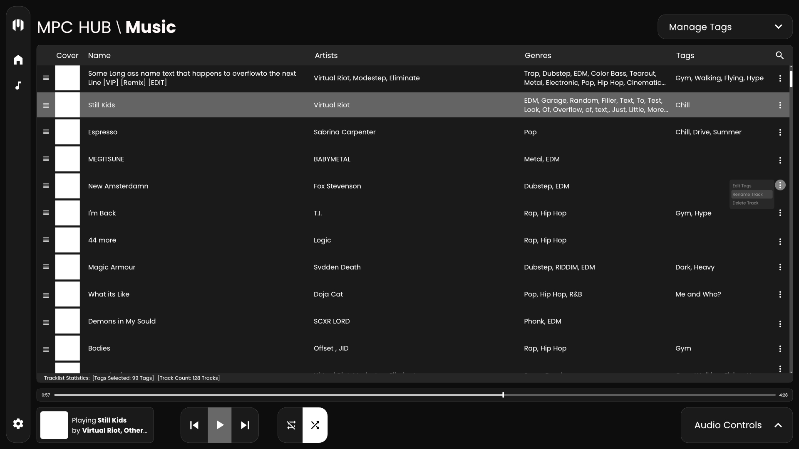

# Project MPC Hub
## Current Version: v0.0

## Contents
- Description 
- How to run
- Images
- Music Player Roadmap
- Future Plans

## Description
**A desktop application to assist you in your personal life. Starting with the ideal (in my opinion) music player.**

To give some insight on what makes the approach for this music player ideal to me, essentially:
- All tracks in your library will be presented to you by default.
- From here you add tags to them, which essentailly is like creating a playlists, however, the "playlist" is abstracted away as a filterable tag. 
- To explain that further, you would filter the display of tracks by just selecting the tags of the tracks you want displayed (tags you create for differnt moods, genres, etc.)
- That functionality is the main feature I've been looking for in a music player, dynamically mixing the content of different playlists. However, it goes further. 
- You can re-order the tracks currently being displayed based on your tag filters, and save this as a "playlist".
- I say "playlist", because what it actually is doing, is saving the combination of tag filter and the order of tracks rather than saving tracks to a specified list which is how a typical playlist works.

## How to Run
### Prerequisites
MPC Hub is an application built with the [Electron](https://www.electronjs.org) Framework. Thus the following pre-requisites will be needed:
- Node.js Runtime (Electron recommends using the latest LTS version)
- npm
### Run Locally
To run the program locally:
1. Clone the repository.
2. Navigate to the project directory
3. Install project dependencies using `npm install`
4. Start the application using `npm run start` (Executes the `electron .` command which can be found  in package.json, under the `scripts` object `start` property).

To build the electron app see (Electron's offical documentation)[https://www.electronjs.org/docs/latest/tutorial/tutorial-packaging].

## Images
After running the app, you should see the screen below.
### Screenshot(s) from App

### Original UI Mock-up(s)

## Music Player RoadMap
### v1.0
- [ ] Track list population from local directory
    - [ ] Title parsing
        - [ ] Basic parsing
        - [ ] Tested for edge cases
    - [ ] Assemble track file meta-data
        - [ ] Track Art (online-first and default fallback)
        - [ ] Manually change, remove track art
    - [ ] Alphabatize track list by default
    - [ ] re-order tracks
    - [ ] implement track options
        - [ ] rename
        - [ ] Edit Track's tags, 
        - [ ] Delete track (locally and globally)
    - [ ] Search active tracklist (artist, track title)
        - [ ] Editing or playing results (when playing, if result is not in active tracklist, it will show in playnow, but will be present in tracklist once results ui is escaped.)
    - [ ] Tracklist statistics (tags, tracks, playtime)
- [ ] Tag System
    - [ ] View tags menu, create, delete, update tags. 
    - [ ] Tracklist display modes using tags
    - [ ] Search tags from tags menu
- [ ] Track playback control
    - [ ] Play, pause, skip tracks; sync seeker & timecodes 
    - [ ] Loop and shuffle active track and tracklist
    - [ ] Seeking tracks using seeker and timecode.
    - [ ]   
- [ ] Audio Controls
    - [ ] Volume controls
- [ ] Menu bar
    - [ ] Home menu 
    - [ ] Settings menu
- [ ] Shortcuts 
    - [ ] Play, pause, next, previous (compatible with keyboard function keys as well)

## Future Plans
- Media API implementation for OS playback controls and data
- Auto add genre tags using online APIs/sources
- Located and track more Meta data(date published, album, duration, listens)
- Chorus-Verse volume preferences (consitent volume, louder chorus)
- Docker Repositioning (Very far future)
- Custom Theming
- Gap-less playback
- Limiter controls
- Playback Speed implementation
- Waveform track seeker
- Smart Auto Mixer (Personal favourite future idea)
    - transitional playback; fading between tracks
    - playback order determined by various heuristics (key, mood/tags, tempo, desktop activity, weather, location etc.)
- Different tracklist views
- Connecting YT, spotify, soundcloud playlists (if possible, as best as possible)

**Feedback is more than welcome!**
